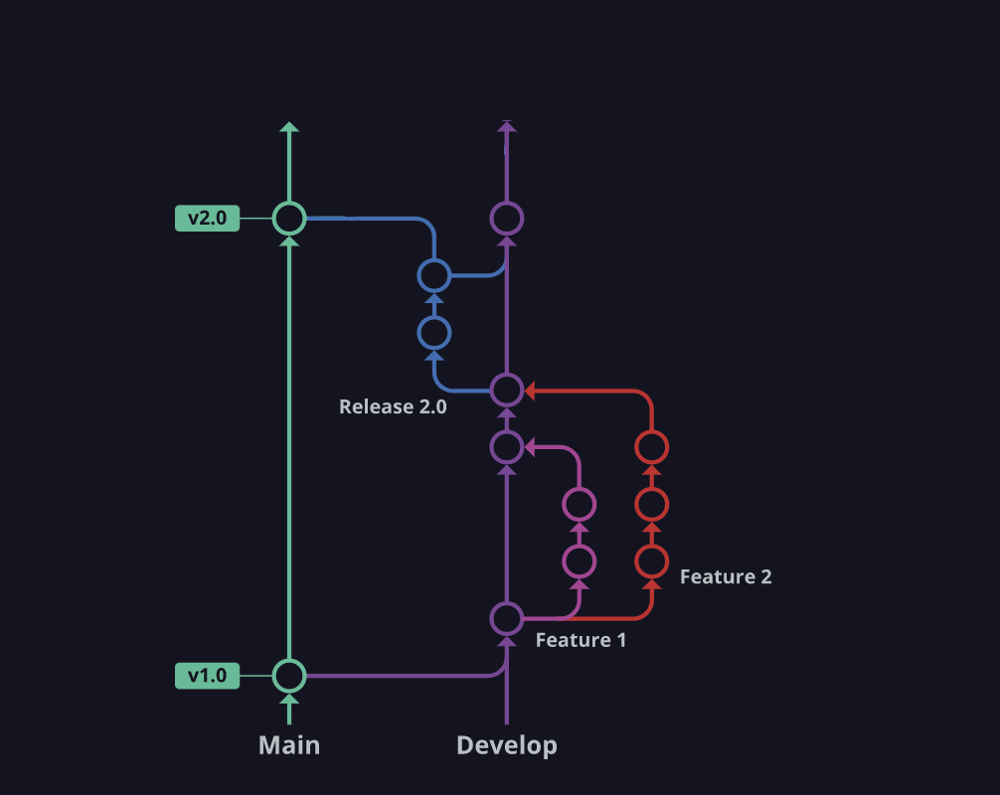

## Workflow
For this project we decide to use the Gitflow with some modifications to adecuate this workflow to our needs.
We will have 3 different branche types:
- Main
- Develop
- Feature

### Main branch
The purpose of the main branch is to contain the production-ready code that can be uploaded to the production environment.
We will only merge the branch develop to main, after all the team were agree that the develop branch is ready to be merged.

### Develop branch
The purpose of this branch is to contains the pre-production code with newly developed features.
Once a bunch of features are tested and all the team agree that are ready to go live, this branch could be merged to main branch.

### Release branch
The release branch should be used when preparing new production releases.

### Feature branch
This will be the most commond type of branch.
The purpose of this branch is to develop a new feature. The origin of this branch always will be develop branch and always should be merged to develop when the feature is approved and reviewed for others members of the team.
This branches must have the following naming convention: `feature/issue-number/short-description-of-the-feature`. For example `feature/1/implement-first-feature`.
To be able to merge a feature into develop, it will be mandatory to open a PR on Github and reference the issue to this PR, so we can keep track of the advance of each card using Projects inside Github.

### Why not a hotfix branch?
Because this project will be not be on a productive environment, so we do not need to guarantee the full disponibility of the product.
If we identify a bug, we do not have to create a hotfix, we could take our time to solve the issue.

### Gitflow diagram
